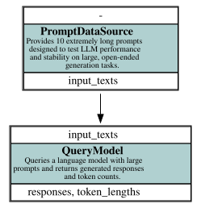

# LLM Resource Comparison Example — async-graph-bench

This example demonstrates how **async-graph-bench** can benchmark large language models (LLMs) across **different configurations and providers**. It allows you to compare the current model implementations, **online OpenAI-style API endpoints** and **local offline vLLM inference**, including multi-instance setups for GPU parallelism.

The goal is to provide a flexible benchmarking setup to evaluate **performance, throughput, and token statistics** across multiple LLM backends.

---

## 🧩 Overview

The benchmark runs a simple computation graph that queries LLMs using a data source of prompts that will induce lengthy responses. The QueryModel node represents a model query with configurable parameters, batching, and resource management.

The workflow demonstrates how you can:

* Run LLM benchmarks with **multiple different providers** (OpenAI endpoints or local vLLM)
* Compare **different model configurations**, including multi-instance parallelization
* Collect **detailed metrics** such as token lengths and time per query
* Store results for later inspection
* Visualize the **execution graph** to understand node dependencies

---

## 🗂 Components

> 
> *Execution graph of the LLM benchmark workflow.*

### **DataSource**

* **`DummyDataSource`**
  Provides a set of prompts for testing, serving as a consistent input for all LLM backends.

### **Computation Node**

| Node           | Description                                                                                            | Requires | Provides                    |
|----------------|--------------------------------------------------------------------------------------------------------|----------|-----------------------------|
| **QueryModel** | Sends prompts to the configured LLM resource and returns the model output along with token statistics. | `prompt` | `response`, `token_lengths` |

> Additional nodes (e.g., statistics or evaluation) can be added similarly for post-processing or benchmarking metrics.

---

## 🏗 Output Structure

* **`data/`** – Folder containing JSON files with model responses and token statistics per resource configuration.
* **`execution_graph.svg`** – Visualization of the execution graph showing nodes and edges for the benchmark.

---

## ▶️ How to Run

0. **install additional dependencies**

    ```bash
    cd examples/resource_benchmark
    uv pip install -r requirements.txt
    ```

1. **Set environment variables** for online endpoints in a `.env` file:

   ```bash
   OPENAI_API_ENDPOINT_1_BASE_URL="https://api.openai.com/v1"
   OPENAI_API_ENDPOINT_1_API_KEY="key_here"
   OPENAI_API_ENDPOINT_1_MODEL="gpt-3.5-turbo"
   OPENAI_API_ENDPOINT_2_BASE_URL="https://api.openai.com/v1"
   OPENAI_API_ENDPOINT_2_API_KEY="key_here"
   OPENAI_API_ENDPOINT_2_MODEL="gpt-4"
   ```
<
2. **Run the benchmark script:**

   ```bash
   python run.py --resources endpoint-1 --batch-size 50
   ```

   **Options for `--resources`:**

    * `endpoint-1` / `endpoint-2` – Single OpenAI-style API endpoint
    * `both-endpoints` – Run across both endpoints
    * `offline-vllm` – Single local vLLM instance
    * `offline-vllm-multi-instance` – Multiple local vLLM instances across available GPUs

3. **Optional arguments:**

    * `--model` – Specify the model name for offline vLLM
    * `--llm-args` – Dictionary of additional arguments for vLLM initialization

4. **Inspect results:**

    * Check the `data/` folder for JSON outputs
    * Open `execution_graph.svg` for a visual overview of the benchmark
    * Review the console output and `benchmark.csv` for detailed statistics

## Tests

**Use a dedicated virtual environment for this example.** Do not reuse the
environment of another example. Install the main library and
`requirements.txt` into that environment before running the tests.

The tests are in `tests/` and can be run from the repository root:

```bash
pytest examples/resource_benchmark/tests -m "not slow"
```

Fast tests use a deterministic mock model and exercise the CLI help path
without contacting an endpoint. The slow integration test uses the tiny
random vLLM model and validates response and token-length collection. It does
not start the multi-instance GPU benchmark.

---

## ⚙️ Metrics and Reporting

After the benchmark:

* **Token statistics** – Track lengths of responses for each prompt
* **Time per query** – Measure efficiency of different LLM resources
* **Aggregated CSV report** – Includes resources, model names, batch size, average token lengths, and time per query

This allows you to **compare both performance and output characteristics** between online and offline LLM setups.

---

## 💡 What to Learn from This Example

* How to use async-graph-bench with **multiple LLM providers**
* How to benchmark both **cloud APIs and local inference** efficiently
* How to configure **batch sizes, parallel instances, and LLM parameters**
* How to collect and store **detailed benchmarking metrics** for reproducibility
* How to visualize and inspect the **execution graph** for complex resource setups

## Note

When examining `benchmark.csv`, you may observe that using `vllm-offline-multi-instance` increases processing speed, but the improvement is not linear—for example, using 8 instances does not yield an 8× speedup. This behavior arises from the framework’s **asynchronous, concurrent execution model**. Once the combined throughput of all model instances exceeds the rate at which items can be processed, serialized, and passed between nodes on the main thread, additional instances no longer contribute to overall speed. Increasing the `batch_size` may help mitigate this bottleneck, but a **performance ceiling** will eventually be reached due to these synchronization and utility overheads.

# Local Installation

## vLLM

Use `vLLM` for **fast local inference** with batching and GPU acceleration.

---

### Initial Setup

Connect via the **gateway**:

```bash
ssh -J <user>@uts.hzdr.de <user>@rosi5
```

Then load required modules:

```bash
ml python/3.12.4 cuda/12.8 gcc/14.2.0
```
---
Create a virtual environment:

```bash
python -m venv venv_vllm
source venv_vllm/bin/activate
pip install wheel setuptools vllm
```

---

### Model Caching & HuggingFace Setup

By default, Hugging Face caches models in `~/.hf_cache`. Beware: They are large!

You can set a custom cache location:

```bash
export HF_HOME=/bigdata/haicu/mueller3/hf-cache/huggingface
mkdir -p $HF_HOME
pip install --upgrade huggingface_hub
```

---

### Hugging Face Authentication

Create an access token at  
[https://huggingface.co/settings/tokens](https://huggingface.co/settings/tokens)

Then log in:

```bash
huggingface-cli login
```

Download a model (e.g., _Ministral-8B-Instruct-2410_):

```bash
huggingface-cli download mistralai/Ministral-8B-Instruct-2410
```

---

### Starting an HPC Session

Run on GPU nodes:

```bash
screen -U
# H100
srun -c 8 --time 4:00:00 --pty --gres=gpu:8 -p gpu-h100 bash -l -i
# A100
srun -c 8 --time 4:00:00 --pty --gres=gpu:8 -p gpu-a100 bash -l -i

ml python/3.12.4 cuda/12.8 gcc/14.2.0
export HF_HOME=/bigdata/haicu/mueller3/hf-cache/huggingface
source venv_vllm/bin/activate
```

---

### **Serving Local Models with vLLM (1)**

1. **Get your local machine’s IP address:**
	```bash
	hostname -i
	```
2. **Start a vLLM model server** for your chosen model (example: _Ministral-8B-Instruct-2410_):
	```bash
	vllm serve mistralai/Ministral-8B-Instruct-2410 \
		--tensor-parallel-size 1 \
		--tokenizer-mode mistral \  # required for Mistral models
		--port <PORT> \
		--api-key <MY_API_KEY>      # optional – set or omit as needed
	```
---
### **Serving Local Models with vLLM (2)**
3. **Connect to the API endpoint:**
	* **Endpoint:** `http://<IP>:<PORT>/v1`
    - **API Key:** `<MY_API_KEY>` (or leave blank if none was set)

✅ **Tip:**  
You can verify that the server is running by visiting  
`http://<IP>:<PORT>/docs` — vLLM automatically hosts an OpenAPI UI there.

---
### vLLM Arguments (1)

Common configuration options for `vLLM.LLM` allow you to control GPU usage, memory management, and inference behavior.
- `tensor_parallel_size` — Number of GPUs to use in parallel for model inference. Use `1` for single-GPU, or more to distribute large models across multiple GPUs.
- `tokenizer` — Path or name of the tokenizer to use. Useful when the model’s tokenizer differs from its default or when using custom vocabularies.
---
### vLLM Arguments (2)
- `gpu_memory_utilization` — Fraction of each GPU’s memory available for inference (default: `0.9`). Lower this value if you encounter out-of-memory errors.
- `enable_prefix_caching` — Enables caching of prompt prefixes to speed up repeated or batched queries with shared context.
---
### vLLM Arguments (3)
- `enforce_eager` — Forces eager execution (disables CUDA graph optimizations). Useful for debugging or when encountering kernel compilation issues.
- `max_model_len` — Maximum sequence length (in tokens) the model can handle. This controls both input and output size limits.
- `seed` — Random seed for deterministic output generation, ensuring reproducible results across runs.
---
Model-specific configurations can be found in:

- `DEFAULTS`
- `kwargs_a100` (A100 GPUs)
- `kwargs_h100` (H100 GPUs)  

# For Debugging

## Check Available Models

```bash
curl --header "Authorization: Bearer $OPENAI_API_KEY" https://api.helmholtz-blablador.fz-juelich.de/v1/models
```

## Perform simple query

```bash
curl https://api.helmholtz-blablador.fz-juelich.de/v1/chat/completions \
-H "Content-Type: application/json" \
-H "Authorization: Bearer ${OPENAI_API_KEY}" \
-d '{
     "model": "alias-fast",
     "messages": [{"role": "user", "content": "Say this is a test!"}],
     "logprobs": "true"
   }'
```
